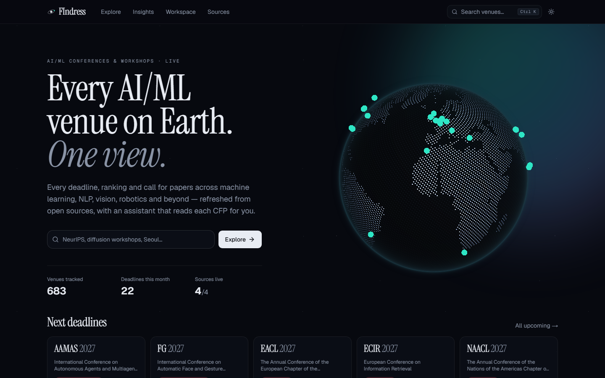
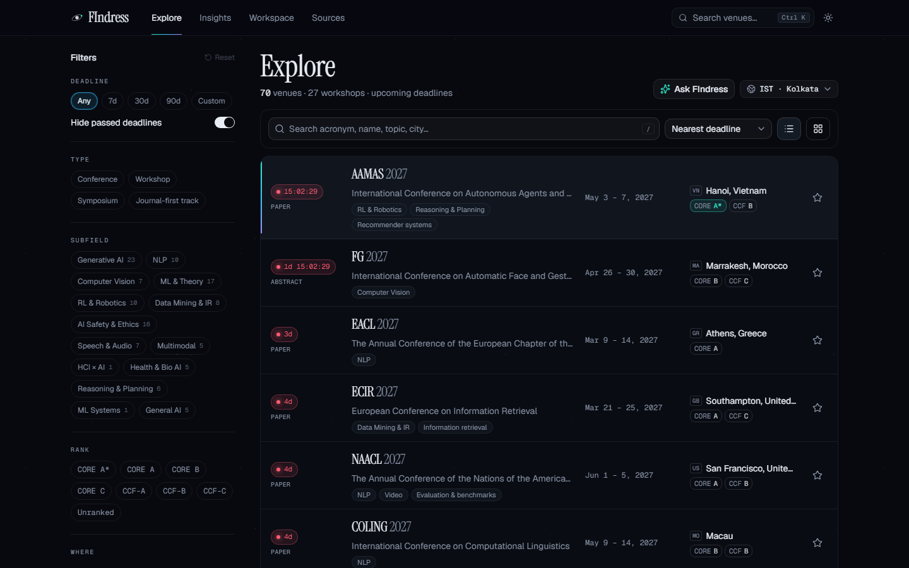
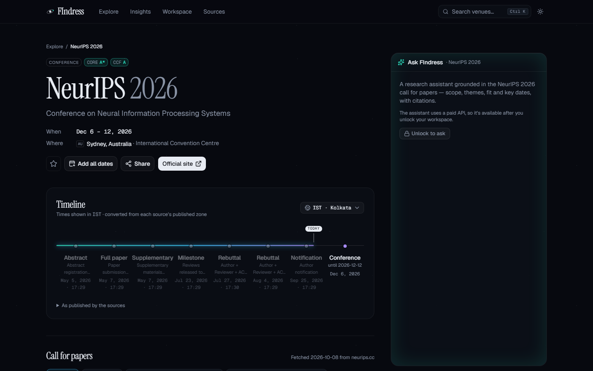
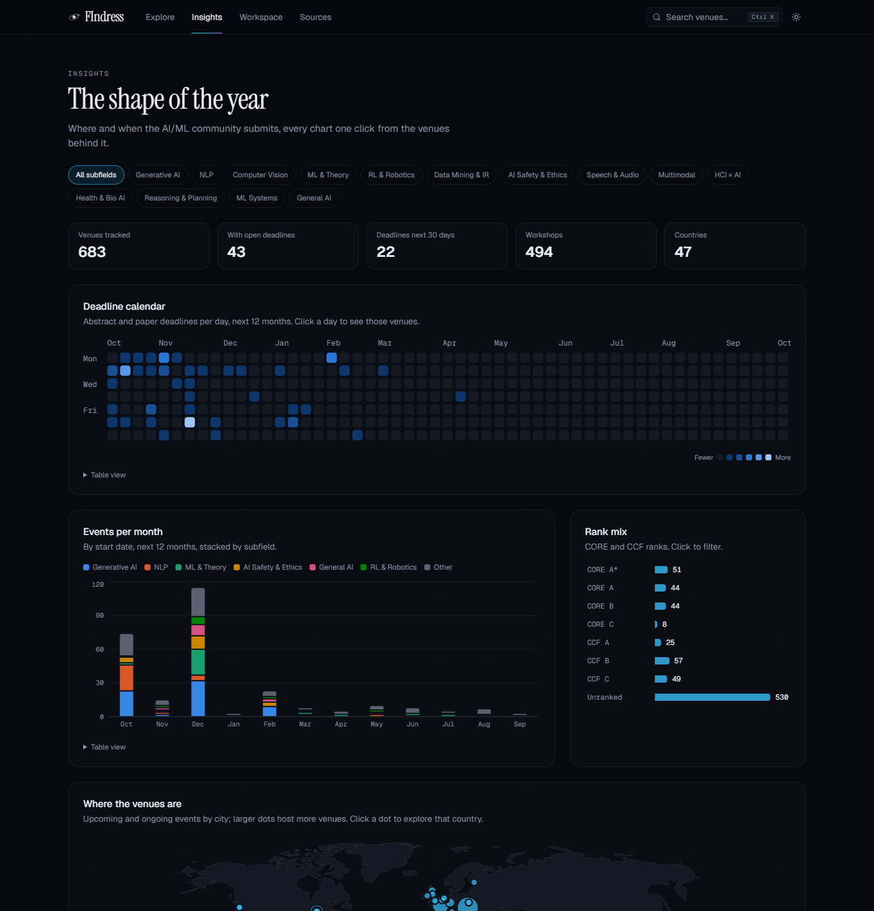
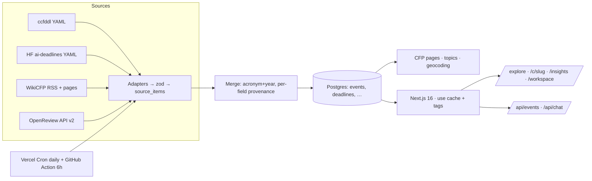

# FIndress

Every AI/ML conference and workshop in one view — live deadlines (AoE-correct, shown in your
timezone), rankings, acceptance rates, CFP text, insights, a private workspace, and an assistant
grounded in each event's real call for papers.






## Architecture



## Run locally
```bash
pnpm install
pnpm db:local        # embedded Postgres on :54329 (or set DATABASE_URL to Neon)
pnpm db:migrate
pnpm ingest          # --steps=ccfddl,huggingface,openreview,wikicfp,merge,cfp,topics,geocode
pnpm dev             # http://localhost:3000 — unlock at /unlock with APP_PASSWORD
pnpm test            # unit tests · pnpm test:e2e (against pnpm start)
```

## Environment variables
See `.env.example`: `DATABASE_URL`, `CRON_SECRET`, `GITHUB_TOKEN` (optional), `ENABLE_LLM_TAGGING`,
`AI_PROVIDER`, `AI_MODEL`, `ANTHROPIC_API_KEY`, `AI_GATEWAY_API_KEY`, `AI_EFFORT`,
`CHAT_RATE_LIMIT_PER_HOUR`, `CHAT_MAX_OUTPUT_TOKENS`, `APP_PASSWORD`, `AUTH_SECRET`,
`NEXT_PUBLIC_SITE_URL`, `NEXT_PUBLIC_DEFAULT_TIMEZONE`.

## Ingestion
- `GET /api/ingest?source=<step>` with `Authorization: Bearer $CRON_SECRET` (Vercel Cron, daily).
- `.github/workflows/ingest.yml` calls each step every 6 hours (secrets `CRON_SECRET`, `SITE_URL`).
- Owner "Refresh now" on `/sources`. Every run is logged in `source_runs`; one failing source never
  stops the others. Polite fetching: `FIndressBot/1.0` UA, robots.txt, ≥1 req/s per host (WikiCFP 5 s).

## Public API <a id="api"></a>
- `GET /api/events` — query params as `/explore`: `q` (full-text), `type`, `subfield`, `rank`
  (`A*,A,B,C,CCF-A,CCF-B,CCF-C,unranked`), `window` (`7|30|90|custom` + `from`,`to`), `passed=1`,
  `evfrom`, `evto`, `continent`, `country`, `mode`, `abstract=1`, `rebuttal=1`, `blind=1`,
  `community=1`, `sort` (`deadline|date|rank|name|recent`), `limit` (≤200), `offset`.
  Returns `{ total, limit, offset, items[] }`. Cached `s-maxage=300`.
- `GET /api/events/{slug}` — full record incl. deadlines, CFP text, sources.
- `GET /api/events/{slug}/ics` — calendar file.

Owner-only (cookie from `/unlock`): `/api/chat`, `/api/workspace/*`.
